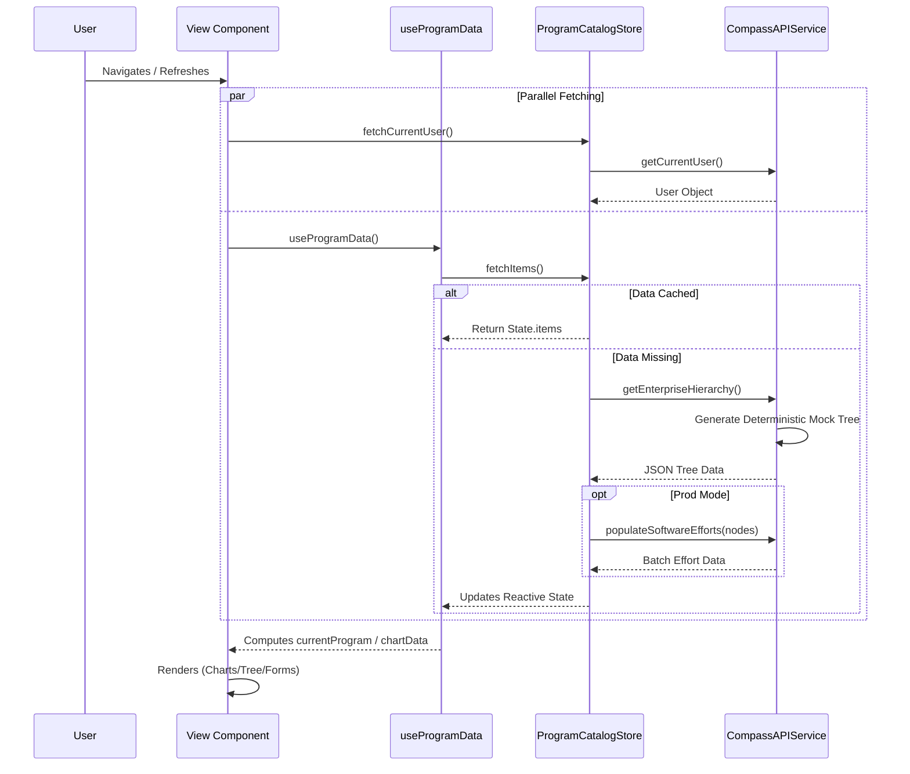
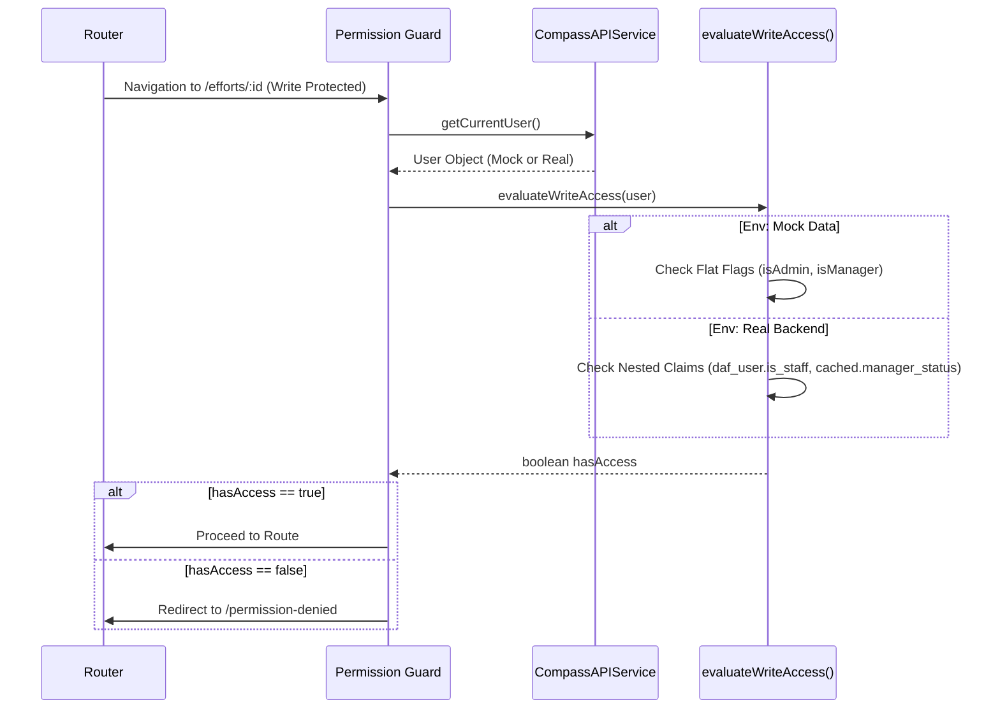
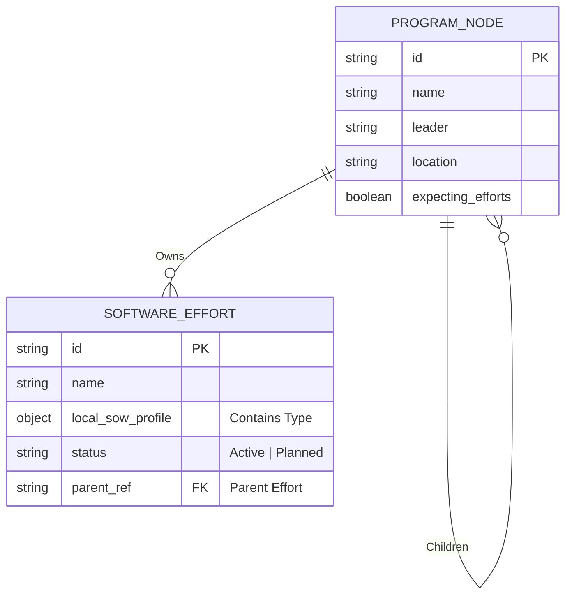

# Program Catalog (PGC)

The **Program Catalog** is a modern Vue 3 application designed to visualize and manage complex enterprise program hierarchies. It allows users to navigate organizational trees, manage software efforts, and track dependencies across distinct program units.

## 🚀 Key Features

*   **Executive Dashboard**: High-level overview featuring "Big Stat" metric cards, compliance charts (ECharts), and program status distribution.
*   **Interactive Organization Chart**: A dynamic tree visualization representing the enterprise hierarchy from Divisions down to Teams.
*   **Master-Detail Effort Management**: A comprehensive interface to create, edit, and link software efforts. Features vertical tabs for Statement of Work, POCs, and Developer Setup.
*   **Contextual Help System**: Integrated "Info" buttons within forms that toggle detailed explanations for specific form sections (SOW, POCs, etc.), guiding users on data requirements.
*   **Search & Deep Linking**: Global search with autocomplete that deep-links directly to specific programs or software efforts, preserving state via URL.
*   **Consistent UX**: Material Design 3 (M3) styling, inclusive of a "clean" aesthetic and responsive layouts.

## 🛠 Technology Stack

*   **Framework**: [Vue 3](https://vuejs.org/) (Composition API)
*   **Build Tool**: [Vite](https://vitejs.dev/)
*   **State Management**: [Pinia](https://pinia.vuejs.org/) (Reactive Store)
*   **Routing**: [Vue Router](https://router.vuejs.org/)
*   **Visualization**: [Apache ECharts](https://echarts.apache.org/) (Dashboard) & Custom SVG (OrgChart).
*   **Styling**: Vanilla CSS with CSS Variables (Theming) & Material Design 3 tokens.
*   **Icons**: [@mdi/js](https://pictogrammers.com/library/mdi/) (SVG Paths).

## 📦 Setup & Installation

1.  **Clone the repository**
    ```bash
    git clone <repository-url>
    cd pgc
    ```

2.  **Install Dependencies**
    ```bash
    npm install
    ```

3.  **Run Development Server**
    ```bash
    npm run dev
    ```
    Access the app at `http://localhost:5173`.

## 🏗 Architecture & Design

### Component Structure
The application simulates a routed Single Page Application (SPA) with three main views.

```mermaid
classDiagram
    direction TB
    class App {
        +RouterView
        +Sidebar
        +Breadcrumbs
        +GlobalSearch
        +UserMenu
    }
    class Dashboard {
        +MetricCards
        +ComplianceChart
        +StatusPieChart
        +InventoryGrid
    }
    class ProgramTreeView {
        +OrgChart
        +Legend
        +FilterState
    }
    class ProgramEffortsView {
        +MasterDetailLayout
        +LoadingState
    }
    class SoftwareEffortsList {
        +TreeNavigation
        +Pagination
    }
    class SoftwareEffortForm {
        +EditForm
        +TabNavigation
        +ContextualHelp
    }
    class PermissionDenied {
        +ContactSupportInfo
    }
    class Store {
        +State: items (Tree)
        +State: currentUser
        +Action: fetchItems()
        +Action: fetchCurrentUser()
        +Getter: findByOrgId()
    }

    App --> Dashboard : Route /dashboard
    App --> ProgramTreeView : Route /
    App --> ProgramEffortsView : Route /efforts/:id
    App --> PermissionDenied : Route /permission-denied
    
    ProgramEffortsView *-- SoftwareEffortsList
    SoftwareEffortsList *-- SoftwareEffortForm
    
    Dashboard ..> Store : Reads Data
    ProgramTreeView ..> Store : Reads Data
    ProgramEffortsView ..> Store : Syncs Selection
    App ..> Store : Checks User Info
```

### Data Flow
The application uses a **Mock API Layer** (`api.js`) to simulate backend calls with artificial latency and deterministic data generation.



### Authentication & Permissions
The app strictly separates **Mock** (Dev) and **Real** (Prod) access logic to ensure rigorous security in deployment while allowing flexible testing.



### Contextual Help Breakdown
The application includes a helper system for complex forms.

*   **Mechanism**: Toggleable "Info" icons (`mdiInformation`) in section headers.
*   **Content**: Defined in `SoftwareEffortForm.vue` (`helpContent` object).
*   **UI**: Renders an expandable card (`help-card`) with a title and detailed description of the section's purpose (e.g., explaining why "Statement of Work" is critical).

### Entity Relationship (Simplified)



## 📂 Project Structure

```text
src/
├── components/          # GUI Components
│   ├── OrgChart.vue             # D3-like Tree Visualization
│   ├── SoftwareEffortsList.vue  # Master list logic for efforts
│   ├── SoftwareEffortForm.vue   # Complex edit form with Help System
│   ├── SoftwareEffortTreeItem.vue # Recursive tree item for effort lists
│   ├── MetricCard.vue           # (Concept) Dashboard stats
│   ├── SearchBox.vue            # Global Search
│   └── ...
├── composables/         # Shared Logic
│   └── useProgramData.js        # Data binding hook
├── services/            # API Layer
│   └── api.js                   # Deterministic Mock Data Generator
├── store/               # State Management
│   └── programCatalogStore.js   # Pinia-like Reactive Store
├── views/               # Page Views
│   ├── Dashboard.vue            # Metrics & Charts
│   ├── ProgramTreeView.vue      # Hierarchy Explorer
│   └── ProgramEffortsView.vue   # Effort Management (Master-Detail)
├── App.vue              # Root Layout, Header, Breadcrumbs
└── main.js              # Entry Point
```

## 🤝 Contributing
1.  Fork the repo.
2.  Create a feature branch.
3.  Commit your changes.
4.  Push to the branch and open a Pull Request.
