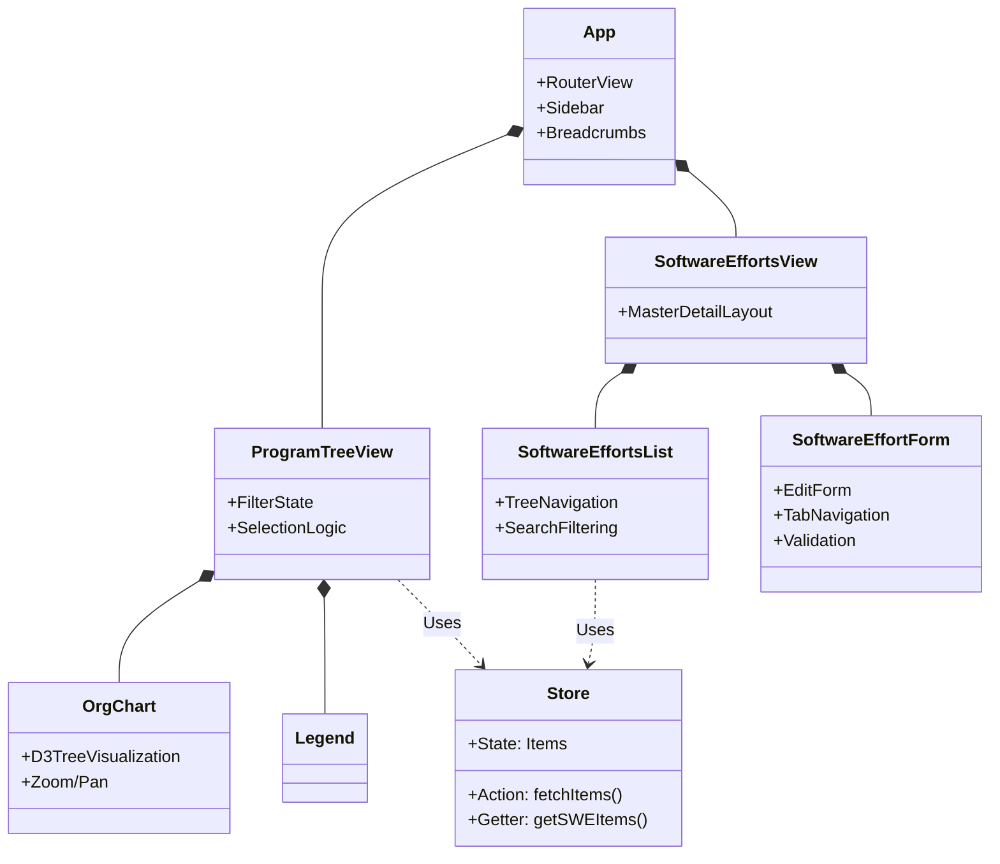
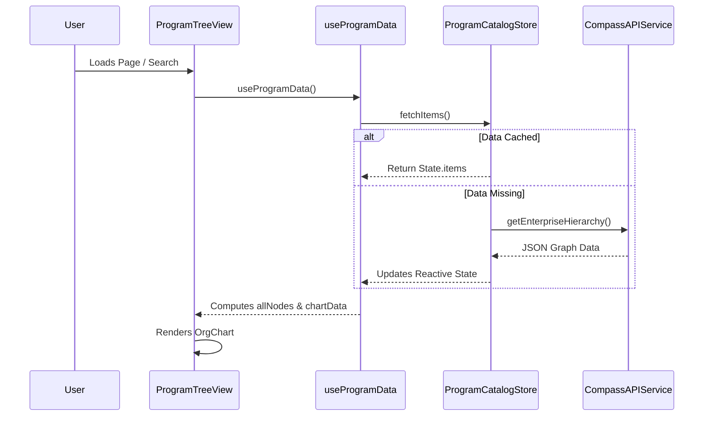
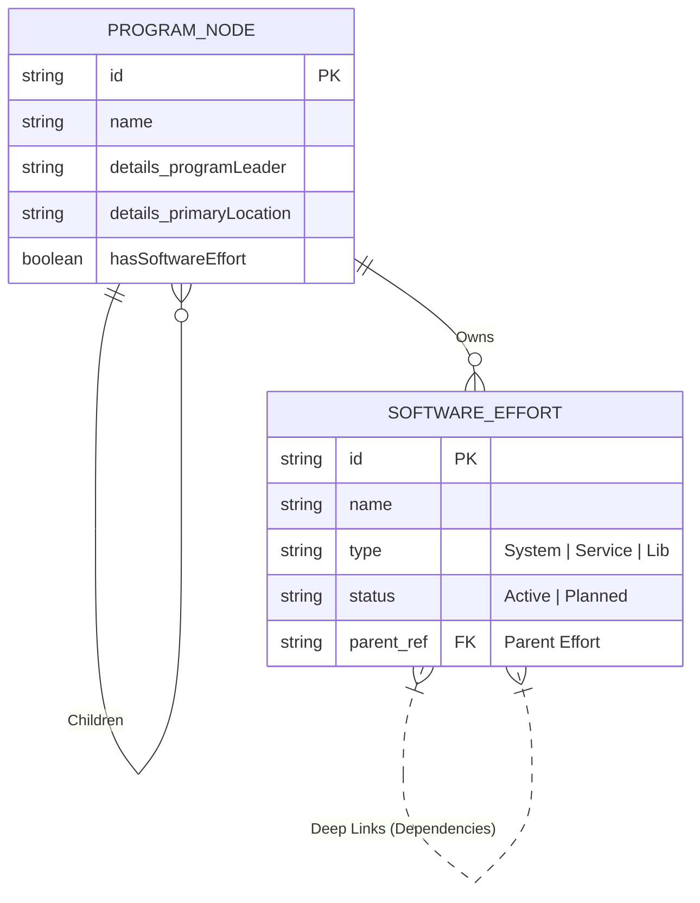

# Program Catalog (PGC)

The **Program Catalog** is a modern Vue 3 application designed to visualize and manage complex enterprise program hierarchies. It allows users to navigate organizational trees, manage software efforts, and track dependencies across distinct program units.

## 🚀 Key Features

*   **Interactive Organization Chart**: A dynamic tree visualization (D3-like) representing the enterprise hierarchy from Divisions down to Teams.
*   **Search & Deep Linking**: Global search with autocomplete that deep-links directly to specific programs or software efforts, preserving state via URL.
*   **Contextual Details**: Interactive sidebars and modals provide detailed metadata for selected nodes (Leaders, Locations, Value).
*   **Software Effort Management**: A master-detail view for creating, editing, and linking software efforts (SOWs, POCs, etc.) to specific program nodes.
*   **Responsive Design**: Material Design 3 (M3) styling with responsive layouts and dark-mode compatible CSS variables.

## 🛠 Technology Stack

*   **Framework**: [Vue 3](https://vuejs.org/) (Composition API)
*   **Build Tool**: [Vite](https://vitejs.dev/)
*   **State Management**: [Pinia](https://pinia.vuejs.org/) (Reactive Store)
*   **Routing**: [Vue Router](https://router.vuejs.org/)
*   **Styling**: Vanilla CSS with CSS Variables (Theming) & Material Design 3 tokens.
*   **Icons**: FontAwesome

## 📦 Setup & Installation

1.  **Clone the repository**
    ```bash
    git clone <repository-url>
    cd pgc
    ```

2.  **Install Dependencies**
    ```bash
    npm install
    ```

3.  **Run Development Server**
    ```bash
    npm run dev
    ```
    Access the app at `http://localhost:5173`.

## 🏗 Architecture & Design

### Component Architecture
High-level overview of the application structure and component relationships.



### Data Flow
How data moves from the Mock API through the Store to the UI.



### Entity Relationship
Simplified data model showing the relationship between Hierarchy Nodes and Software Efforts.



## 📂 Project Structure

```text
src/
├── components/          # GUI Components
│   ├── OrgChart.vue     # Tree Visualization
│   ├── Legend.vue       # Interactive Status Key
│   ├── SearchBox.vue    # Global Search
│   └── ...
├── composables/         # Shared Logic (Hooks)
│   └── useProgramData.js
├── services/            # API & Mock Data Layers
│   └── api.js
├── store/               # State Management
│   └── programCatalogStore.js
├── views/               # Page Views (Router Targets)
│   ├── ProgramTreeView.vue
│   └── ProgramEffortsView.vue
├── App.vue              # Root Component
└── main.js              # Entry Point
```

## 🤝 Contributing
1.  Fork the repo.
2.  Create a feature branch.
3.  Commit your changes.
4.  Push to the branch and open a Pull Request.
